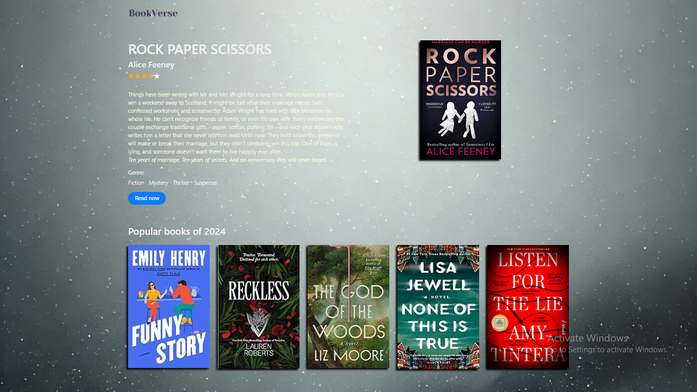

<h1 align='center'><b>💥 BOOK WEBSITE 💥</b></h1>

<!-- -------------------------------------------------------------------------------------------------------------- -->

<h3 align='center'>Tech Stack Used 🎮</h3>
<!-- enlist all the technologies used to create this project from them (Remove comment using 'ctrl+z' or 'command+z') -->

    
    
    

## :zap: Description 📃

  <!-- 
Add Description of the project
 -->
    
This is a static book website that provides a detailed description of one featured book. At the bottom of the page, you can also find images of five popular books from 2024. The website offers a clean, minimal design for easy browsing.

<!-- -------------------------------------------------------------------------------------------------------------- -->

## :zap: How to run it? 🕹️

<!-- Add steps how to run this project -->
- Clone the repository to your local machine.
- Open the `index.html` file in your web browser to start using the application.

<!-- -------------------------------------------------------------------------------------------------------------- -->

## :zap: Screenshots 📸
<!-- add the screenshot of the project (Mandatory) -->

<!-- -------------------------------------------------------------------------------------------------------------- -->

<h4 align='center'>Developed By <b><i>ABANKITA BEHERA</i></b></h4>

  
  

